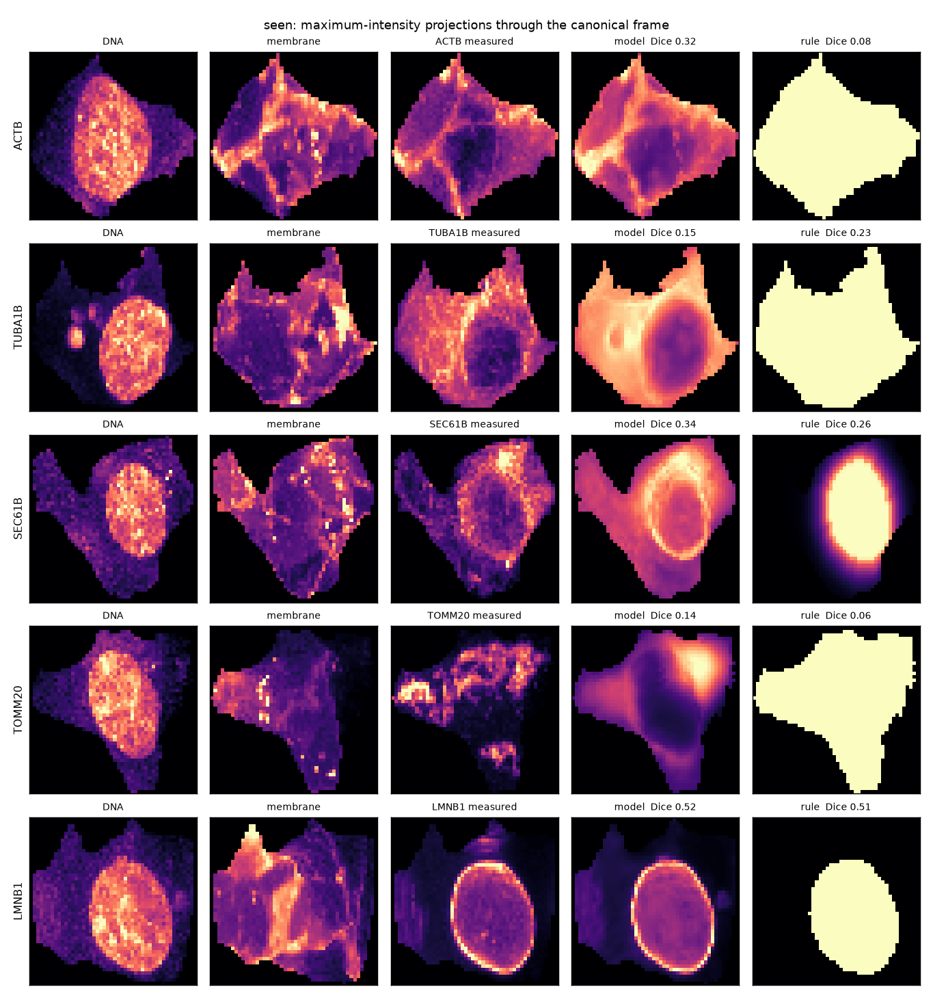
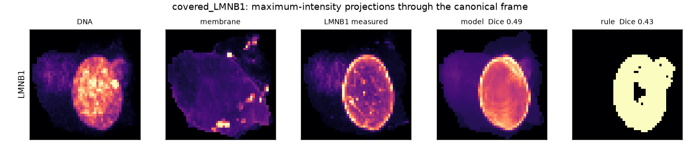

# Result: the model learns where compartments are, not which protein you asked for

Pre-registered in [`docs/PREREG_VIRTUAL_CELL.md`](PREREG_VIRTUAL_CELL.md).
900 WTC-11 cells, 9 cell lines, 24 GB of Allen Institute crops, ten trained
models, five metrics, eight predictors, ~80 minutes of protocol on four CPU
cores.

Every number below comes from `scripts/vcell_result.py`, `vcell_controls.py`
and `vcell_audit.py` reading the run's own JSON, which is committed under
[`data/vcell/`](../data/vcell/). Nothing is transcribed by hand.

## The short version

| registered hypothesis | verdict |
|---|---|
| **H1** — trained structures, held-out cells | **3 of 5 structures pass.** LMNB1 and TUBA1B fail |
| **H2** — the structure held out entirely | **1 of 5 passes.** And the four that don't fail for the reason the addendum predicted |
| **H3** — identity is used | passes for 4 structures, **fails for TUBA1B**, and fails in a deeper way described below |
| **H4** — the joint virtual cell | **passes**, and it is the cleanest result here |
| **H5** — mitosis | **1 of 5 passes**, and LMNB1 fails in exactly the readable way that was registered in advance |
| **H6** — held out with the compartment covered | **2 of 3 pass** — and the partner's annotation scores *as well or better* in all three |
| **gate 4** — beat the untagged control | **fails for 4 of 5 structures**, and no rescaling fixes it |

The one sentence: **conditioning on a protein's annotated compartment plus this
cell's DNA and membrane channels predicts organelle placement well above every
atlas and retrieval baseline — but in every fold where it can be tested, the
prediction depends on the compartment and not on the protein.** Hand the model a
different protein from the same compartment and the score does not drop. Hand it
the untagged control line's annotation and, for actin, the score goes *up*.

## What the data actually is

| line | structure | cells | FOVs | cell volume (µm³) | nucleus (µm³) | structure, % of cell |
|---|---|---|---|---|---|---|
| ACTB | actin filaments | 80 | 80 | 1757 ± 420 | 515 | 3.4 |
| TUBA1B | microtubules | 80 | 80 | 1752 ± 592 | 519 | 12.2 |
| SEC61B | ER | 80 | 80 | 2043 ± 515 | 565 | 11.9 |
| TOMM20 | mitochondria | 80 | 80 | 1804 ± 514 | 532 | 8.5 |
| LMNB1 | nuclear envelope | 80 | 80 | 1723 ± 517 | 503 | 9.3 |
| AAVS1 | **none — diffuse control** | 80 | 80 | 1758 ± 484 | 506 | 18.3 |
| ATP2A2 | ER (H6 partner) | 80 | 80 | 1507 ± 417 | 436 | 11.0 |
| NUP153 | nuclear pores (H6 partner) | 80 | 80 | 1707 ± 417 | 497 | 3.0 |
| ACTN1 | actin bundles (H6 partner) | 80 | 80 | 1909 ± 478 | 547 | 3.1 |

Plus 180 mitotic cells (20 per line) never trained on. Canonical voxel measured
at **0.40 × 0.39 × 0.63 µm** — finer than the "roughly a micron" the
pre-registration guessed, and still far coarser than a microtubule.

Not one cell was dropped in framing, out of 900.

## H1 — trained structures, held-out cells

Volume-matched Dice, 16 held-out cells per line. Model against the three
baselines H1 registers, compared **paired per cell** — every predictor is
scored on the same cells, so the right test is paired, not whether two marginal
intervals overlap:

| structure | model | own atlas | pooled atlas | annotation rule | reference-only | registered verdict |
|---|---|---|---|---|---|---|
| ACTB | **0.193** | 0.059 | 0.039 | 0.121 | 0.124 | pass |
| SEC61B | **0.344** | 0.172 | 0.150 | 0.276 | 0.276 | pass |
| TOMM20 | **0.223** | 0.116 | 0.087 | 0.146 | 0.094 | pass |
| AAVS1 *(control)* | **0.435** | 0.289 | 0.129 | 0.251 | 0.240 | pass |
| LMNB1 | 0.482 | 0.251 | 0.217 | **0.525** | 0.145 | **fail** — rule wins, paired −0.043 [−0.078, −0.002] |
| TUBA1B | 0.157 | 0.139 | 0.132 | 0.170 | **0.181** | **fail** — ablated model wins, paired −0.024 [−0.042, −0.006] |

Gate 2 was written to take exactly this result away, and it does:

> *"A structure where the rule wins is reported as a structure the model did not
> learn, however good its raw correlation looks. LMNB1 is expected to be the hard
> case here and is named in advance."*

**LMNB1 is reported as a structure the model did not learn.** A half-micron shell
straddling the boundary of the DNA channel, with no fitted parameters, places lamin
B1 better than the network does. The pre-registration called this in advance, and
the clause "however good its raw correlation looks" was written to forestall the
rescue that is available here: on the other four metrics the model wins decisively
(Pearson r 0.917 vs 0.663, nuclear-distance W1 0.244 vs 0.817 µm). That rescue is
declined, for a reason the data supply. All four of those metrics are
density-weighted, the model emits a graded field trained by cross-entropy between
unit-mass densities — i.e. optimised for exactly that — and the rule emits a binary
shell. Volume-matched Dice is the one axis on which the two objects are comparable,
which is why it was registered as the placement metric, and the rule wins it. That
W1 margin is not placement evidence either: a **static per-structure atlas**, one
fixed image reused for every cell, also beats the rule on LMNB1's W1 (0.464 vs
0.817) while placing the structure half as well by Dice.

Making the tie-breaking fair widens the LMNB1 gap rather than closing it.
`dice_volume_matched` takes the top *k* voxels via `argpartition`, which breaks
ties by array index, and five of the six geometric rules emit binary fields where
every shell voxel is tied. Rescored with random tie-breaking, the nuclear shell
rule goes **up** (0.555 → 0.577 on a 24-cell sample), and the cytoplasm rule that
serves AAVS1 goes 0.196 → 0.254. Index-order tie-breaking was flattering the
model, not the baselines.

**TUBA1B fails three separate ways.** It loses to the conditioning-ablated model,
ties the annotation rule, and its lift over its own chance level is 1.25× against
2.6–5.7× for the other four. The projections say what the number means: the
prediction is a uniformly bright cytoplasm with a hole where the nucleus is. At
0.4 µm voxels, microtubules are not resolved and were registered as out of scope;
what is in scope is that a respectable-looking Dice of 0.157 is what "no
structure predicted" scores when the target fills 12% of the cell.

## Gate 4 — the untagged control, and why no rescaling saves it

AAVS1 is mEGFP at a safe-harbour locus with no fusion partner: a structure
channel with nothing in it. Gate 4 registered its score as the floor. On the
registered metric the floor is **0.435**, and only LMNB1 (0.482) clears it.
SEC61B (0.344), TOMM20 (0.224), ACTB (0.193) and TUBA1B (0.157) are all below a
channel containing no structure.

The obvious objection is that volume-matched Dice is thresholded at the true
structure's voxel count, so random placement scores the structure's base rate,
and the base rates span 0.034 to 0.185. That objection is correct, and it does
not rescue the gate:

| structure | chance | Dice | lift = Dice/chance | lift ceiling = 1/chance | excess = (Dice−chance)/(1−chance) |
|---|---|---|---|---|---|
| ACTB | 0.034 | 0.193 | **5.71×** | 29.7× | 0.165 |
| LMNB1 | 0.093 | 0.482 | 5.19× | 10.8× | **0.429** |
| SEC61B | 0.127 | 0.344 | 2.70× | 7.9× | 0.248 |
| TOMM20 | 0.085 | 0.223 | 2.63× | 11.8× | 0.151 |
| **AAVS1** *(control)* | 0.185 | 0.435 | 2.35× | 5.4× | **0.307** |
| TUBA1B | 0.125 | 0.157 | 1.25× | 8.0× | 0.036 |

On lift the control drops to fifth of six — but lift's ceiling is 1/chance, and
AAVS1's highest possible lift is 5.41×, *below ACTB's actual 5.71×*. So part of
that demotion is arithmetic, not measurement. Switch to the bounded
chance-corrected excess, which follows from the identical premise, and the
control comes back **second of six**. On the four metrics that involve no volume
matching at all it ranks 2nd (r), 2nd (nuclear-fraction error), 3rd (W1) and 4th
(COM). Its W1 (0.204 µm) and nuclear-fraction error (0.012) are *better* than
LMNB1's (0.244, 0.035).

So gate 4 is reported as **failed**, not as mis-specified. Declaring the metric
wrong after seeing the measurement would convert a 1-of-5 pass into a 4-of-5
pass, and nothing in the pre-registration licenses swapping a gate's metric post
hoc. What the gate caught is real: at this resolution, in this frame, a diffuse
structureless channel is easy to predict, because predicting "cytoplasm, not
nucleus" gets most of it — and that is a large part of what the model is doing
for the real structures too.

## H2 — the structure held out entirely

The addendum predicted this would be unanswerable, for an arithmetic reason
committed before any real image was scored: hold out a structure and its
compartment input is identically zero in every training cell, so the weights
reading it never receive a gradient.

Against the registered comparators — the pooled atlas **and** the geometric rule
— **one fold of five passes.**

| fold | chance | model | shuffled identity | annotation rule | pooled atlas | registered verdict |
|---|---|---|---|---|---|---|
| loso_TOMM20 | 0.085 | **0.170** | 0.154 | 0.132 | 0.074 | **pass** |
| loso_SEC61B | 0.119 | 0.236 | 0.223 | **0.265** | 0.126 | fail — rule wins, −0.029 |
| loso_TUBA1B | 0.122 | 0.136 | **0.175** | 0.157 | 0.122 | fail — rule wins, −0.021 |
| loso_ACTB | 0.034 | 0.017 | 0.004 | **0.108** | 0.037 | fail — rule and atlas win |
| loso_LMNB1 | 0.093 | 0.002 | 0.160 | **0.538** | 0.147 | fail — rule wins by 0.537 |

Two folds land *below* their own chance level. `loso_LMNB1` at 0.002 against a
0.093 base rate is not merely uninformative, it is anti-placed — the same
collapse the synthetic positive control produced before the real data was
touched (0.002 there too).

And the folds that survive do not survive because of transfer. **Feed the same
checkpoint a different protein's annotation and you get nearly the same score:**
0.223 against 0.236 in `loso_SEC61B`, 0.154 against 0.170 in `loso_TOMM20`, and
in `loso_TUBA1B` and `loso_LMNB1` the wrong identity wins outright (0.175 vs
0.136; 0.160 vs 0.002). Across the four non-LMNB1 folds the model's lift and its
shuffled control's lift correlate r = 0.93. What survives a hold-out is an
**identity-blind cytoplasmic prior** — it overlaps diffuse cytoplasmic targets
like ER and mitochondria, and misses cortical actin and the nuclear envelope.
Worth noting how little Pearson r sees of this: `loso_ACTB` keeps r = +0.654
while placing actin *below* chance by Dice, which is a direct measure of how
much of a correlation between two 3D fields is bought by respecting the cell
outline.

The sharpest single number: in `loso_ACTB`, asking the model for the **AAVS1
control** — a line with no structure in it — scores 0.238 on real actin, while
asking it for actin scores 0.017, a factor of fourteen. The full per-line
ranking on those same 80 cells is AAVS1 0.238, TUBA1B 0.067, ACTB *itself*
0.017, SEC61B 0.009, TOMM20 0.005, LMNB1 0.004. That 0.238 also beats the properly trained
`covered_ACTB` model asked for actin (0.216) and the `seen` model (0.193).

H2 is therefore reported as registered and as predicted: **no**, and for the
reason given in advance.

## H6 — held out, with the compartment covered

The answerable version. Hold out a protein while a different protein annotated
to the same compartment stays in training. Two of three pass the registered
criterion:

| fold | held out | partner kept | model | partner's vector | annotation rule | verdict |
|---|---|---|---|---|---|---|
| covered_SEC61B | Sec61β | ATP2A2 (SERCA2) | 0.309 | **0.313** | 0.265 | pass |
| covered_ACTB | β-actin | ACTN1 (α-actinin-1) | 0.216 | 0.209 | 0.108 | pass |
| covered_LMNB1 | lamin B1 | NUP153 | 0.524 | **0.539** | **0.538** | **fail** — ties the rule, −0.014 [−0.032, +0.003] |

Read the second and third numeric columns together. **In all three folds a
different protein's annotation vector scores as well as or better than the
held-out protein's own.** In `covered_ACTB` the best wrong answer is not even the
actin partner — it is AAVS1, the structureless control, at 0.224, above the
model's own 0.216. Per-line, for actin: AAVS1 0.224 > ACTB 0.216 > ACTN1 0.209 ≫
ATP2A2 0.009 > SEC61B 0.007 > TOMM20 0.004 > LMNB1 0.003.

So the transfer is real and it stops at the compartment. That is not a spin on a
success; it is the reading the pre-registration wrote down in advance and it
includes a prediction that **failed**:

> *"H6 prediction, on the record before the run: the covered folds beat the
> pooled atlas, and beat their own H2 counterparts, and still fall short of the
> same structure's score in the `seen` fold. If they instead match `seen`, the
> partner was too similar and the fold was easier than advertised."*

`covered_LMNB1` (0.524) strictly exceeds `seen` (0.482) with non-overlapping
intervals, and `covered_ACTB` (0.216) exceeds `seen` (0.193). Only
`covered_SEC61B` falls short as registered — and it is the only fold whose
identity control is a genuinely wrong answer, because its alphabetical neighbour
is TOMM20 rather than its partner. The registered adverse reading applies.

The seen-versus-covered comparison also carries a confound in the other
direction, and it should be named rather than leaned on: the covered models
trained on 640 cells across eight lines against `seen`'s 384 across five, which
at the fixed 25 epochs is 4,000 gradient steps against 2,400. The same confound
applies to the covered-versus-H2 gap. No size-matched control was run. The
*test*-set difference, by contrast, explains nothing: `seen`'s 16 cells are a
subset of the covered folds' 80, and on those same cells the covered models
still match or beat the seen model.

## H3 — identity, decomposed

The registered gate asks whether feeding a different protein's vector makes
things worse. It does, for four of five structures, and the decomposition is more
informative than the gate. For ACTB in the `seen` fold: own identity 0.193,
averaged over same-compartment lines 0.128, averaged over different-compartment
lines **0.007** — against a chance level of 0.034. A wrong *compartment* puts the
density somewhere five times worse than random. So the compartment block of the
annotation vector is carrying real information.

Two caveats that cut the other way. First, my implementation of the gate feeds
the alphabetically next cell line, which is not what was registered ("the
knowledge vector of a different protein") and is a poor choice: for TUBA1B the
alphabetical neighbour is AAVS1, the most favourable wrong answer available for a
diffuse target, and averaged over all five wrong identities the true vector wins
(0.157 vs 0.152). The headline "shuffling helps TUBA1B" is partly an artefact of
that ring. Second, in the two covered folds the neighbour is the same-compartment
partner, so the gate could not fail there at all; that is the bug, and reading
the swap as a measurement instead is what produced the H6 finding above.

## H5 — mitosis

100 mitotic cells of the five registered structures (plus 20 control), never
trained on, scored with the interphase-trained model. One structure of five
passes the registered criterion (ACTB). The pre-registration asked for a specific
kind of failure:

> *"The nuclear envelope disassembles in mitosis, so a model that learned
> 'LMNB1 = boundary of the DNA channel' should fail a mitotic cell in a specific,
> readable way."*

| LMNB1, by stage | n | model Dice | shell rule Dice | model r | W1 (µm) | nuclear-fraction error |
|---|---|---|---|---|---|---|
| interphase | 16 | 0.482 | 0.525 | 0.917 | 0.244 | 0.035 |
| M1M2 (prophase) | 6 | 0.382 | 0.483 | 0.807 | 0.206 | 0.020 |
| M3 (prometaphase) | 5 | 0.142 | 0.114 | 0.295 | 0.581 | 0.107 |
| M4M5 (metaphase/anaphase) | 9 | 0.053 | 0.054 | **−0.192** | **1.825** | 0.214 |

That is the registered failure, in the registered direction, at the registered
stages. By metaphase the correlation is *negative* and the radial error has grown
sevenfold: the model is still laying envelope density around the boundary of a
nucleus that has disassembled. And the shell rule built from the DNA channel
alone degrades in lockstep (0.525 → 0.483 → 0.114 → 0.054) while the atlas,
nearest-cell and reference-only baselines all degrade less. So this is not
evidence that the model represents envelope biology. It is evidence that the
model learned the same DNA-channel shortcut the rule implements — which is what
the pre-registration said this test would reveal.

## H4 — the joint virtual cell

The one clean positive result, and the one closest to the original idea:
predict all five structures onto a single cell's geometry, then check whether
their pairwise radial arrangement matches the arrangement measured between real
structures imaged in *different* cells.

| pair | measured W1 (µm) | virtual cell W1 (µm) | error |
|---|---|---|---|
| TOMM20 – TUBA1B | 0.08 | 0.09 | +0.01 |
| ACTB – TOMM20 | 0.17 | 0.13 | −0.04 |
| ACTB – TUBA1B | 0.20 | 0.13 | −0.08 |
| SEC61B – TUBA1B | 0.38 | 0.55 | +0.17 |
| SEC61B – TOMM20 | 0.40 | 0.54 | +0.14 |
| ACTB – SEC61B | 0.57 | 0.66 | +0.09 |
| LMNB1 – SEC61B | 1.45 | 1.23 | −0.22 |
| LMNB1 – TOMM20 | 1.84 | 1.77 | −0.08 |
| LMNB1 – TUBA1B | 1.82 | 1.77 | −0.05 |
| ACTB – LMNB1 | 2.02 | 1.88 | −0.13 |

Correlation **0.990** across all ten pairs, mean absolute error **0.101 µm**. The
obvious objection is that four of ten pairs involve the only nuclear structure,
so the correlation might just be "the model knows LMNB1 is nuclear". Excluding
LMNB1 entirely leaves six cytoplasmic pairs spanning only 0.08–0.57 µm, and the
correlation is still **0.959** (Spearman 0.886), with only adjacent-pair
inversions in the ordering. The fine structure is reproduced, not just the
nuclear/cytoplasmic split.

Two limits. This is a population property of 96 virtual cells averaged, not a
property of any one of them — per-cell radial error (0.12–0.36 µm) is larger than
most of the separations being resolved. And it has no paired ground truth by
construction; reproducing population arrangement is necessary for a virtual cell
to be worth anything and nowhere near sufficient.

## Three things wrong with this study's own machinery

Found by adversarial review of a first draft of this document, which refuted all
twelve of its headline claims. Reported because the pre-registration's discipline
section promised every baseline whole, including the ones that embarrass the model.

**1. The registered leakage safeguard is a no-op.** "Split by FOV, never by cell"
was the headline protection. But the sampler maximises field diversity, and it
succeeded completely: 480 cells over 480 fields, **at most one cell per field**.
So `split_by_fov` is a uniformly random cell split and the "FOV-clustered
bootstrap" is an ordinary per-cell bootstrap. No leakage was introduced, but none
was prevented either. Meanwhile the batch structure that *does* cross the split is
uncontrolled: 171 imaging plates, **63 of them on both sides**, only 7 test-only.
A plate-held-out split is the right protection and was not run.

**2. Marginal intervals were reported where paired tests were needed.** `vcell
train` publishes a bootstrap interval per predictor; comparing predictors by
interval overlap is far too conservative when every predictor is scored on the
same cells. `scripts/vcell_audit.py` adds the paired version, and it changes
verdicts in both directions — the LMNB1 gate-2 loss is clean when paired and
ambiguous when marginal; the TUBA1B win over the atlas is thin either way
(+0.018 [+0.001, +0.038], the model ahead on 11 of 16 cells).

**3. The conditioning-ablated baseline is missing from every hold-out fold.**
H1 registers three baselines and `reference_only` is one of them — the one that
beats the model on TUBA1B. `train.py` passes it only for the `seen` and `mitotic`
folds, so no H2 or H6 fold has it. That is the baseline that would say how much
of a hold-out score is available with no protein information at all, and it was
not run where it mattered most.

## The lesson

The gates did their job, and the job turned out to be taking most of the result
away.

Going in, the risk I was guarding against was that a conditional generator would
produce plausible-looking organelles and there would be no way to be wrong. The
four gates were built for that. What they actually caught was narrower and more
interesting: **the model is a very good estimator of where a compartment sits in
a particular cell's geometry, and it knows essentially nothing about proteins.**
Every test that can separate those two things says so — the partner's vector
scoring as well as the protein's own, the structureless control's vector
predicting actin as well as actin's, the identity-blind prior carrying the
surviving hold-out folds, the shell rule matching the network on lamin B1 and
degrading with it through mitosis.

That is not a failure of the model. It is what the available conditioning can
support. A 17-compartment annotation vector over five structures is, to a very
good approximation, a one-hot compartment label, and a one-hot compartment label
is exactly what the model learned to decode. The two structures that failed H1
are the two where compartment tells you least: the nuclear envelope, where the
compartment *is* a morphological operation on an input channel, and microtubules,
where at 0.4 µm the compartment label "cytoplasm" is the whole prediction.

So the honest scaling conclusion is the opposite of "more proteins, more of the
same". The jump from 5 to 1,310 proteins is not a scale-up of this result, it is
the first point at which the question this experiment asks becomes separable from
the question it can answer. With many proteins per compartment, holding one out
leaves its compartment represented **and** leaves a within-compartment
discrimination to make — and a within-compartment discrimination is the only
thing that would show a model had learned a protein rather than a place.

## What would be worth doing next, in order

1. **Hold out a protein against several partners in its own compartment.**
   OpenCell has 1,310 lines; the ER, the nucleolus, the mitochondrion and the
   plasma membrane each carry dozens. The measurement is whether the model can
   rank the right protein above its compartment-mates, which is the question
   this study could not ask. Two of the 25 Allen lines — microtubules and
   mitochondria — have no compartment-mate at all, which caps what this dataset
   can do here whatever the sample size.
2. **Split by plate, not by field.** 63 of 171 plates straddle the current split.
3. **Put `reference_only` in every fold** and report each hold-out score against
   the no-protein-information floor.
4. **Report the AAVS1 control on the same axis as every structure, in every
   fold.** It was the most informative predictor in this study and it is a line
   with nothing in it.
5. **Raise the resolution before claiming morphology.** At (32, 64, 64) this same
   code runs on a GPU. Filaments and cristae are where the interesting failures
   would be, and 0.4 µm voxels cannot see them.
6. **Then time.** The Allen transmitted-light timelapse has no DNA or membrane
   channel in this form, so 4-D needs either label-free prediction of the
   reference channels first or a different acquisition. It is a separate study,
   not a next epoch of this one.
