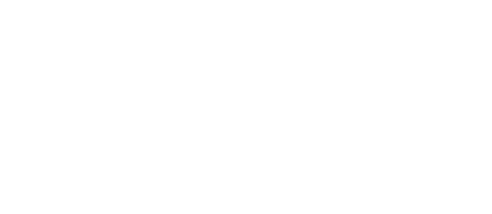

# Two Squares — Design & Build · website

A static portfolio site for a design-and-build studio working on restaurants, bars and shops.
No build step, no framework: open `index.html` in a browser and it works.
Upload the folder to any host (Netlify, Vercel, GitHub Pages, cPanel) and it works there too.

```
site/
├── index.html          Home — green hero, the 3D building walkthrough, sectors, drifting project grid
├── restaurants.html    Sector page — restaurants (afternoon amber accent)
├── bars.html           Sector page — bars (dusk slate accent), with an image "story" chapter
├── retail.html         Sector page — shops (sage accent)
├── studio.html         About / team / services
├── contact.html        Enquiry form + studio details
├── project.html        Template for a single project case study (duplicate per project)
├── assets/
│   ├── css/site.css    All styling. Colours + type live in the :root block at the top.
│   ├── js/app.js       All scroll / motion effects (see "How the effects work")
│   └── img/*.svg       Placeholder "renders". Replace with your photos.
└── tools/make_placeholders.py   Regenerates the placeholder images (optional)
```

---

## 1. Make it yours

### Logo
The wordmark is currently typeset in a handwriting font (Homemade Apple) as a stand-in for the
script on your business card. To use the real logo, export it as an SVG (white version) and replace
every `<span class="wordmark">…</span>` with:

```html

```
(Use a dark-green version on off-white sections: `logo-green.svg`.) The wordmark appears in the nav,
the hero, the façade sign inside the walkthrough, and the footer.

### Email, phone, address, socials
```bash
grep -rl "hello@twosquares.studio" site | xargs sed -i 's/hello@twosquares.studio/you@yourdomain.com/g'
grep -rl "+00 000 000 000" site | xargs sed -i 's/+00 000 000 000/+91 98765 43210/g'
```
(macOS: `sed -i ''`.) Also: the address block on `contact.html`, and the footer social links (`href="#"`).

### Photos
Every image is referenced by filename in `assets/img/`. Drop your own photo in with the **same name**
and it appears everywhere that image is used:

| File | Where it's used |
|---|---|
| `hero-01/02/03.svg` | Sector cards on the home page; page headers for restaurants / bars / shops |
| `cafe-morning.svg`, `rest-*.svg` | Café and restaurant projects |
| `bar-*.svg` | Bar projects |
| `shop-*.svg` | Shop projects |
| `studio-team.svg`, `studio-process.svg` | Studio page |

`.jpg` / `.webp` work too — update the `src="..."` in the HTML to match. Aim for 1600px wide and under
400 KB each ([squoosh.app](https://squoosh.app)). Portrait (4:5) suits the project grids; landscape for headers.

### Projects
Project cards appear in three places — copy an existing block and change the text:

- **Floating grid** (`.float-grid` → `.proj`): `data-speed="1.2"` makes a card lead the scroll, `0.85` lag. Keep 0.8–1.3.
- **Location index** (`.index__row`): the hover-to-preview list on sector pages. `data-img` is the cursor thumbnail.
- **Drag rail** (`.hscroll` → `.hcard`): the horizontal "by location" strip.

For a full case study, duplicate `project.html` → `ember.html`, etc., and point the cards' `href` at it.

### Colours & fonts
Top of `assets/css/site.css`:

```css
--bg: #f4f2ec;       /* off-white ground */
--ink: #1f261c;      /* text */
--green: #46523d;    /* card green — hero, bands, CTA, footer */
--rest: #b9722f;     /* restaurants accent */
--bar: #3f5a6e;      /* bars accent */
--retail: #7f8f66;   /* shops accent */
```
Add `class="on-green"` to any section to flip it to a green band; add `ribbons` as well for the card's
tonal pattern. Each sector page sets `<html data-sector="restaurant|bar|retail">` and picks up its accent.

---

## 2. The building walkthrough (home page)

`index.html` → `<section class="walk">`. It's a CSS-3D model: a façade with doors at the front, then
three rooms in a row. Scrolling moves the camera through them; the sky and sun change with the time of day.

- **Rooms** are `.room` boxes with five `.wall` planes each. Colours live in `.room--cafe`, `.room--rest`,
  `.room--bar` in the CSS (`--wall`, `--floor`, `--ceil`, `--pool` for the light on the floor, `--lamp`).
- **Furniture** are `.prop` cut-outs. Position with `--x` (left/right, vw), `--z` (depth — café is 0 to −1,
  restaurant −1 to −2, bar −2 to −3) and size with `--w` / `--h`. Shapes are `<symbol>`s at the top of
  `index.html`; add your own SVG there. `hide-sm` hides a prop on phones.
- **Text panels** are the `.walk__step` blocks. The camera parks in room *k* when panel *k* is centred on
  screen, so you can add or reorder panels freely — but keep one panel per room (plus the entrance).
- **Times of day** — the `SKY` keyframes in `app.js` set the sky gradient and sun position by camera depth;
  the HUD labels are in `.walk__hud`.

---

## 3. Make the contact form send

The form shows a thank-you but doesn't send (there's no server). Two free options:

**Formspree** — in `contact.html`, change `<form class="form" data-demo …>` to
`<form class="form" action="https://formspree.io/f/YOUR_ID" method="POST" …>`.

**Netlify Forms** — change it to `<form class="form" netlify name="enquiry" …>`; submissions land in the Netlify dashboard.

---

## 4. Put it online

- **Netlify Drop** (easiest): app.netlify.com/drop, drag the `site` folder in. Live URL in seconds; custom domain in settings.
- **Vercel**: import the repo, set the root directory to `site`.
- **GitHub Pages**: serve from a branch's root or `/docs`, or use a "deploy static site" Action pointed at `site/`.
- **cPanel / FTP**: upload the *contents* of `site/` into `public_html`.

---

## 5. How the effects work

All motion is in `assets/js/app.js`, switched on with attributes and classes:

| Attribute / class | Effect |
|---|---|
| `data-lift` (`="0.5"` for gentler) | Card tilts toward the cursor, rises on Z and zooms a touch on hover. Don't combine with `data-reveal` on the same element — put the reveal on a wrapper. |
| `data-reveal` (`="left"`, `"right"`, `"scale"`) | Fades and rises into view. `style="--d:200"` delays by 200 ms for staggering. |
| `class="split"` on a heading | Each line slides up from behind a mask. |
| `class="wipe"` around an image | Curtain wipe reveal + slow zoom. |
| `data-parallax="0.2"` | Drifts at 20% of scroll speed (negative goes the other way). |
| `data-float` | Gentle continuous bobbing. Tune with `--float-dur`, `--float-amp`, `--float-rot`. |
| `data-tilt="1.5"` | Follows the mouse in 3D (hero cards). |
| `data-speed="1.2"` on a `.proj` | Grid cards drift past each other while scrolling. |
| `class="liquid"` + `.blob` children | Morphing, drifting blurred blobs (hero, CTA). |
| `class="ribbons"` | The card's tonal curved bands, slowly flowing. |
| `class="walk"` | The scroll-driven 3D building (above). |
| `class="chapter"` | Sticky image story: background swaps per step (bars page). |
| `class="hscroll"` | Drag-to-scroll rail with progress bar. |
| `data-count="64" data-suffix="%"` | Number counts up when in view. |
| `class="marquee"` | Infinite ticker; speeds up when you scroll fast. |

Also built in: page-transition curtain, nav that hides on scroll-down, cursor glow, magnetic buttons, mobile menu.
Everything respects the OS "reduce motion" setting.

---

## 6. Regenerating placeholder images

```bash
python3 site/tools/make_placeholders.py
```
Edit the `PROJECTS` list and palettes (`MORNING`, `AFTERNOON`, `NIGHT`, `SAGE`) in that file.
